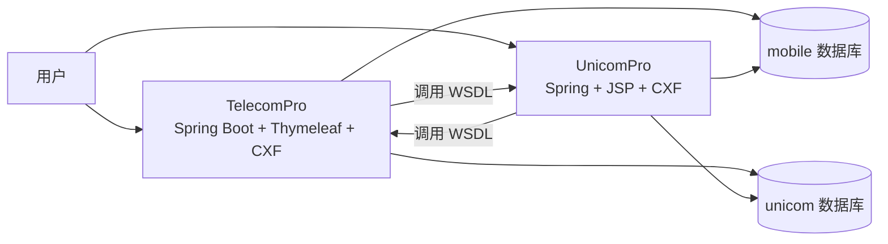
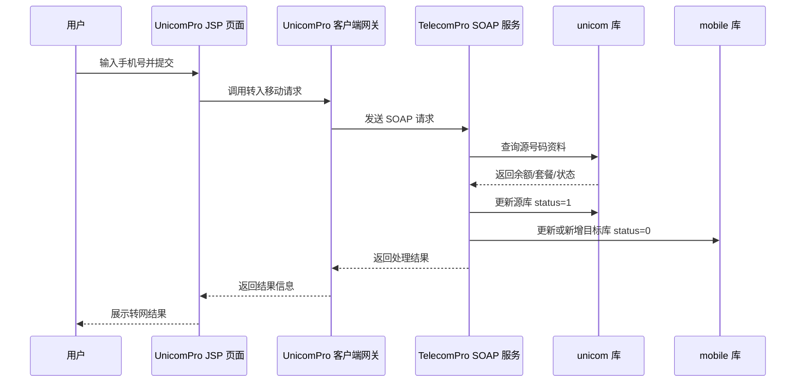
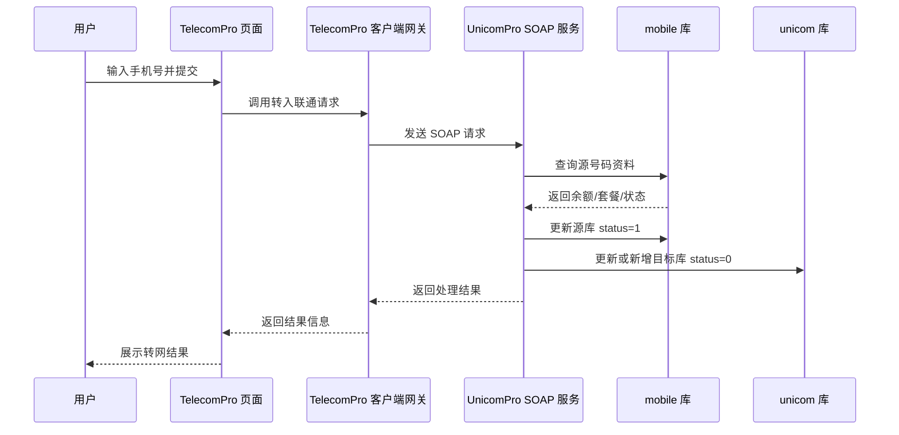

# 实训实验报告

## 一、基本实训任务

1. 搭建两个独立的 Web 系统，系统 A 使用 `Spring + Hibernate + JSP + CXF + MySQL`，系统 B 使用 `Spring Boot + Thymeleaf + MySQL + CXF`。
2. 参考运营商携号转网业务，建立公用实体类手机套餐信息，包含手机号码、余额、套餐描述、套餐状态等字段。
3. 使用 CXF 开发 A 系统的携号转网业务并发布 WSDL 服务地址，开发 B 系统客户端界面和请求转发服务类，调用 A 系统 WSDL。
4. 使用 CXF 开发 B 系统的服务端携号转网业务并发布 WSDL 地址，开发 A 系统客户端界面和请求转发服务类，调用 B 系统业务；要求携号转网成功后对本系统套餐状态做级联修改。

## 二、任务需求分析简述

本次实训的核心目标是通过两个独立系统模拟运营商之间的携号转网流程。项目最终落地为：

- `UnicomPro`：联通侧系统，负责“转入联通”的服务端能力，同时提供客户端页面去调用移动侧服务。
- `TelecomPro`：移动侧系统，负责“转入移动”的服务端能力，同时提供客户端页面去调用联通侧服务。

### 1. 业务分析

携号转网场景中，一个号码在某一时刻只能归属于一个运营商。因此数据库中不仅要保存号码的套餐资料，还要通过状态字段表示该号码是否已经从当前运营商转出。

本项目中的状态定义如下：

- `status = 0`：当前属于本运营商
- `status = 1`：已从本运营商转出

转网成功时需要同时修改两个数据库：

1. 源运营商库中，将该号码改为 `status = 1`
2. 目标运营商库中：
   - 若号码已存在，则更新套餐信息并改为 `status = 0`
   - 若号码不存在，则新增记录并设为 `status = 0`

### 2. 技术分析

为满足题目要求，系统采用双向 SOAP 调用：

- `TelecomPro` 客户端调用 `UnicomPro` 的 WSDL，完成“转入联通”
- `UnicomPro` 客户端调用 `TelecomPro` 的 WSDL，完成“转入移动”

其中：

- 页面端只输入手机号，降低交互复杂度
- 余额、套餐描述等信息不再由用户输入，而是由服务端从源库中自动读取并同步到目标库
- 这样可以保证业务逻辑集中在服务层，避免页面层参与数据库规则判断

## 三、系统结构图

### 1. 整体结构图



### 2. 系统模块划分

#### TelecomPro

- 页面层：Thymeleaf 页面，负责“转入联通”客户端入口与结果展示
- 控制层：接收手机号，转发到联通侧服务
- 网关层：通过 CXF 调用 `UnicomPro` 的 WSDL
- 服务层：提供“转入移动”的服务端能力
- 仓储层：分别访问 `mobile` 和 `unicom` 数据库

#### UnicomPro

- 页面层：JSP 页面，负责“转入移动”客户端入口与结果展示
- 网关层：通过 CXF 调用 `TelecomPro` 的 WSDL
- 服务层：提供“转入联通”的服务端能力
- 仓储层：分别访问 `mobile` 和 `unicom` 数据库

## 四、时序图

### 1. UnicomPro 作为客户端、TelecomPro 作为服务端的时序图

该流程表示“从联通转入移动”。



### 2. TelecomPro 作为客户端、UnicomPro 作为服务端的时序图

该流程表示“从移动转入联通”。



## 五、系统核心代码说明

### 1. 双数据源配置

`TelecomPro` 通过 `DataSourceConfig` 分别配置 `mobile` 和 `unicom` 数据源，并为两个库分别创建 `JdbcTemplate` 与仓储对象。

作用：

- 保证一个系统内可以同时读取源库和写入目标库
- 满足“级联修改两个库”的要求

### 2. 携号转网服务实现

`UnicomPro` 的 `TransferNumberServiceImpl` 与 `TelecomPro` 的 `TransferNumberServiceImpl` 实现方式基本对称：

1. 校验手机号格式
2. 查询源库是否存在该号码
3. 从源库取出余额、套餐描述、状态信息
4. 将源库号码状态更新为 `1`
5. 在目标库中进行 upsert：
   - 存在则更新
   - 不存在则新增
6. 返回转网成功或失败信息

### 3. 客户端请求转发

两边都使用 CXF 的 `JaxWsProxyFactoryBean` 调用对方系统的 WSDL。

这样实现了：

- `TelecomPro -> UnicomPro`
- `UnicomPro -> TelecomPro`

同时又保持了题目要求的“每个客户端只能转入另一个网络”的业务边界。

### 4. 页面优化

页面已做以下调整：

- 表单只保留手机号输入
- `TelecomPro` 页面固定为“转入联通”
- `UnicomPro` 页面固定为“转入移动”
- 结果页风格统一，均采用简洁的 soft UI / neumorphism 风格

## 六、系统运行效果

### 1. 启动方式

#### 启动 UnicomPro

```bash
cd UnicomPro
mvn tomcat7:run
```

#### 启动 TelecomPro

```bash
cd TelecomPro
mvn spring-boot:run
```

### 2. 访问地址

- `UnicomPro` 页面入口：`http://localhost:8080/UnicomPro/home.jsp`
- `UnicomPro` WSDL：`http://localhost:8080/UnicomPro/services/TransferSupportService?wsdl`
- `TelecomPro` 页面入口：`http://localhost:8081/`
- `TelecomPro` WSDL：`http://localhost:8081/services/TransferSupportService?wsdl`

### 3. 运行结果说明

#### 转入联通

1. 在 `TelecomPro` 页面输入手机号
2. 点击转网
3. 系统调用 `UnicomPro` 服务
4. `mobile` 库中对应号码状态变为 `1`
5. `unicom` 库中对应号码更新或新增为 `0`
6. 页面显示统一结果卡片

#### 转入移动

1. 在 `UnicomPro` 页面输入手机号
2. 点击转网
3. 系统调用 `TelecomPro` 服务
4. `unicom` 库中对应号码状态变为 `1`
5. `mobile` 库中对应号码更新或新增为 `0`
6. 页面显示统一结果卡片

### 4. 测试与验证结果

项目完成后执行了以下验证：

#### UnicomPro

```bash
mvn test
mvn -DskipTests compile
```

#### TelecomPro

```bash
mvn test
mvn -DskipTests compile
```

验证结果均通过。

## 七、实践总结

| 项目 | 内容 |
| --- | --- |
| 本次实践收获 | 通过本次实训，我掌握了 CXF 发布和调用 SOAP WebService 的基本流程，理解了双系统之间的接口协作方式；同时熟悉了在一个系统中配置多个数据源并对不同数据库进行联动更新的方法。 |
| 本次实践遇到的问题及采用的解决方法 | 首先，最初的数据源配置在 Spring Boot 运行时出现 `jdbcUrl is required with driverClassName` 问题，后来改为 `DataSourceProperties + initializeDataSourceBuilder()` 的方式解决；其次，前期客户端页面方向与题目要求存在偏差，后续根据 `goat.txt` 修正为“每个客户端只能转入另一个网络”；另外，页面中还出现过中文乱码和结果展示不统一的问题，最终通过统一 UTF-8 文本和统一结果页结构解决。 |

## 八、结论

本次实训项目最终完成了题目要求的双系统搭建、双向 SOAP 调用、双数据库级联修改、客户端页面交互以及统一结果展示。系统能够模拟运营商携号转网的主要业务流程，并通过状态字段准确反映号码归属变化，达到了实训目标。
